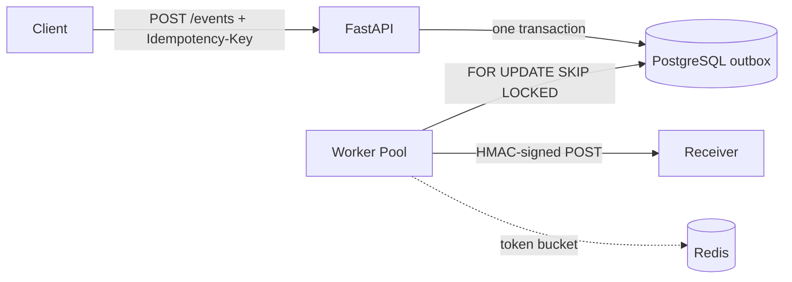

# webhook-delivery

A multi-tenant webhook delivery service — the infrastructure that sits between "an event
happened" and "the customer's server heard about it, reliably."

Webhooks sound trivial (just POST the payload) until receivers are slow, down, or flaky.
Then you need durable queueing, retries that don't DDoS the recovering receiver,
deduplication, sender authentication, and per-tenant isolation. This project builds that
infrastructure from first principles on **PostgreSQL and Redis** — no Kafka, no managed
queue — to show exactly where each guarantee comes from.

## Architecture



## One delivery, with a failure

```mermaid
sequenceDiagram
    participant C as Client
    participant A as API
    participant P as Postgres
    participant W as Worker
    participant R as Receiver
    C->>A: POST /events (Idempotency-Key)
    A->>P: BEGIN: insert event + pending delivery
    A-->>C: 202 Accepted (event_id, replayed)
    W->>P: claim (SELECT ... FOR UPDATE SKIP LOCKED)
    W->>R: POST (X-Webhook-Signature, X-Webhook-Timestamp)
    R-->>W: 500
    W->>P: attempt #1 recorded, next_attempt_at = now + jitter
    Note over W: exponential backoff with full jitter
    W->>R: POST (retry, same signature scheme)
    R-->>W: 200
    W->>P: status = succeeded; COMMIT
```

## Quickstart

```bash
# Start everything
docker compose up --build -d

# Wait for health checks, then:

# 1. Create a tenant (returns an API key — shown once, save it)
curl -s -X POST localhost:8000/tenants \
  -H 'Content-Type: application/json' \
  -d '{"name": "acme"}' | python3 -m json.tool

# 2. Register a webhook endpoint (use your API key from step 1)
curl -s -X POST localhost:8000/endpoints \
  -H 'Authorization: Bearer whsk_YOUR_KEY_HERE' \
  -H 'Content-Type: application/json' \
  -d '{"url": "https://webhook.site/YOUR-UUID"}' | python3 -m json.tool

# 3. Fire an event
curl -s -X POST localhost:8000/events \
  -H 'Authorization: Bearer whsk_YOUR_KEY_HERE' \
  -H 'Idempotency-Key: my-unique-key-1' \
  -H 'Content-Type: application/json' \
  -d '{"endpoint_id": "ENDPOINT_ID_FROM_STEP_2", "event_type": "order.created", "payload": {"order_id": 42}}' | python3 -m json.tool

# Check delivery status
curl -s localhost:8000/metrics | python3 -m json.tool
```

## API Reference

| Endpoint | Auth | Description |
|---|---|---|
| `POST /tenants` | — | Create tenant, returns API key (shown once) |
| `GET /whoami` | Bearer | Verify your key |
| `POST /endpoints` | Bearer | Register receiver URL, returns signing secret |
| `GET /endpoints` | Bearer | List your endpoints (no secrets) |
| `POST /events` | Bearer + `Idempotency-Key` header | Accept event → 202 (or 200 if replayed) |
| `GET /deliveries?status=` | Bearer | Browse deliveries (filter: pending/succeeded/dead) |
| `POST /deliveries/{id}/retry` | Bearer | Revive a dead delivery |
| `GET /metrics` | — | Queue depth, retry/DLQ rates, latency p50/p95/p99 |
| `GET /health` | — | Liveness check |

## Load Test Results (local Compose)

| Metric | Baseline (0% failure) | Stress (30% failure) |
|---|---|---|
| Ingestion req/s | ~180 | ~175 |
| Ingestion p95 | ~12 ms | ~12 ms |
| Delivery p95 | ~85 ms | ~2,100 ms |
| Delivery p99 | ~150 ms | ~5,400 ms |
| DLQ rate | 0% | ~0.2% |
| Retry rate | 0% | ~28% |

Worker concurrency 5→20 improved delivery throughput ~3.5× — confirming the bottleneck is
worker concurrency (one DB connection held per in-flight delivery), not ingestion or
receiver capacity. Full methodology and analysis in [`docs/loadtest.md`](docs/loadtest.md).

## Design Decisions

### At-least-once delivery, by choice

Exactly-once delivery over HTTP is not a real thing — the receiver's ACK can always be
lost (Two Generals). The honest contract is **at-least-once delivery + idempotent
consumers = effectively-once processing**. An example consumer proving this ships in
[`examples/`](examples/).

### Transactional outbox

The delivery job is written in the same PostgreSQL transaction as the event, so an
accepted event can never be silently lost to the dual-write problem.

### Postgres as the queue

Workers claim jobs with `SELECT … FOR UPDATE SKIP LOCKED` — concurrent workers never
grab the same row, and a crashed worker's claim rolls back automatically, requeueing the
job. Trade-off: one DB connection per in-flight delivery (fine at this scale; the
lease-based alternative is documented in [`docs/architecture.md`](docs/architecture.md)).

### HMAC-SHA256 signing

Every delivery carries `X-Webhook-Signature` (`v1=<hex>`) over `timestamp.body` so
receivers can authenticate the sender, verify integrity, and reject replay attacks.

### Exponential backoff with full jitter

`uniform(0, min(cap, base × 2^attempt))` — breaks retry synchronization (thundering
herd) more effectively than equal jitter, with fewer total calls. Dead-letter after 8
attempts with an operator retry endpoint.

### Per-tenant token buckets in Redis

Atomic Lua script enforces per-tenant delivery rate limits so one tenant's event storm
can't starve other tenants' deliveries. Rate limiting at delivery time (not ingestion)
keeps the ingestion path lossless.

### Idempotent ingestion

`Idempotency-Key` header deduplicated by a database unique constraint — not an
application-level check-then-insert race.

## Stack

Python 3.12 · FastAPI · PostgreSQL (SQLAlchemy 2.0 async + Alembic) · Redis · httpx ·
structlog · pytest · Locust · Docker Compose · GitHub Actions

## Deliberately Out of Scope

| Exclusion | Rationale |
|---|---|
| **UI** | This is API infrastructure, not a product with a frontend |
| **Kafka/RabbitMQ** | Postgres-as-queue keeps one source of truth; adding a broker re-introduces the dual-write problem the outbox exists to kill |
| **OAuth** | API keys fit server-to-server; OAuth adds machinery without value here |
| **Payload transformation** | Scope: reliable delivery, not data reshaping |
| **Exactly-once claims** | Impossible over HTTP; claiming it would be dishonest |
| **Kubernetes** | Docker Compose demonstrates the orchestration concepts without operational overhead |

## Project Structure

```
app/
├── main.py              # FastAPI app + router wiring
├── config.py            # Pydantic settings (env vars)
├── db.py                # Async SQLAlchemy engine + session
├── models.py            # 5 tables: Tenant, Endpoint, Event, Delivery, DeliveryAttempt
├── auth.py              # API key generation + Bearer auth
├── outbox.py            # Transactional outbox enqueue
├── delivery.py          # Claim query + HTTP delivery engine
├── worker.py            # Concurrent worker pool (asyncio TaskGroup)
├── signing.py           # HMAC-SHA256 sign/verify
├── backoff.py           # Full-jitter exponential backoff
├── ratelimit.py         # Redis Lua token bucket
├── logging.py           # structlog configuration
└── routers/
    ├── tenants.py       # POST /tenants, GET /whoami
    ├── endpoints.py     # POST/GET /endpoints
    ├── events.py        # POST /events (idempotency dedup)
    ├── deliveries.py    # GET /deliveries, POST retry
    └── metrics.py       # GET /metrics (SQL aggregates)
alembic/versions/        # 4 ordered migrations
examples/receiver.py     # Flaky receiver proving idempotent consumption
locustfile.py            # Load test
docs/
├── architecture.md      # Schema, failure modes, scaling notes
└── loadtest.md          # Method, results, prediction vs reality
```
